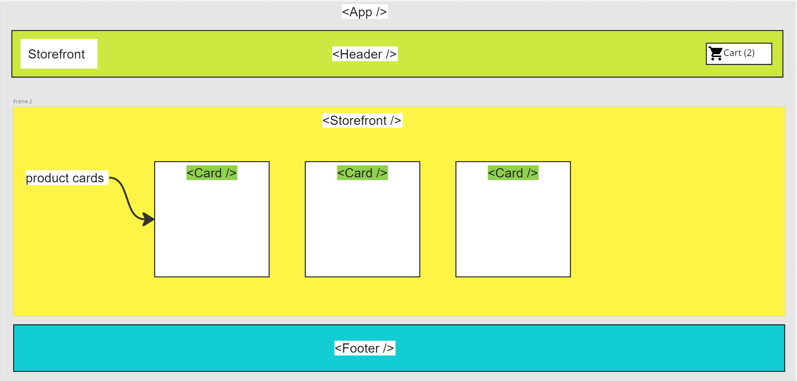

# Storefront

- Creating a virtual storefront that allows users to browse product offerings by category, place items in their shopping cart, and check-out when they are ready to make their purchase.

## Technical Requirements

1. React
2. ES6 Classes
3. Redux Store for
4. Deployed API with MongoDB storage for storing categories and products
5. Superagent or Axios for performing API requests
6. Material UI for layout and styling
7. Test Driven Development using Jest
8. Deployment to a cloud provider (Netlify, Amplify or Github Pages)

## Lab - Application State with Redux

## Phase 1 Application Setup

- Basic React Application
- Redux State Management
- State managed in memory
- Material UI Components & Styling

The following user/developer stories detail the major functionality for this phase of the project.

- As a user, I expect to see a list of available product categories in the store so that I can easily browse products
- As a user, I want to choose a category and see a list of all available products matching that category
- As a user, I want a clean, easy to use user interface so that I can shop the online store with confidence

## Technical Requirements / Notes

And as developers, here are the high level development tasks that address the above end user requirements

- Create a visually appealing site using Material UI
- Use a Redux Store to manage the state of categories and items in the store
- Display a list of categories from state
- When the user selects (clicks on) a category …
  - Identify that category as selected (change of class/display)
  - Show a list of products associated with the category

## UML

